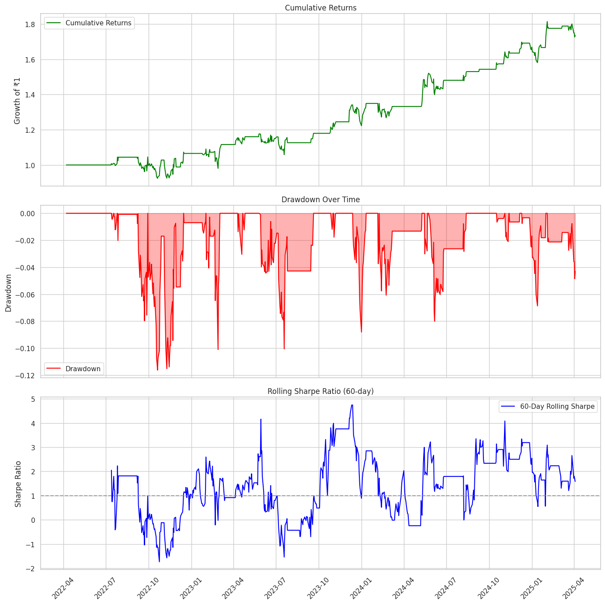

## Pairs Trading
A pairs trading strategy is a market-neutral trading strategy that involves identifying two or more closely related assets, such as two stocks, whose prices move together. Once these pairs of stocks are identified, the idea is to trade any divergence in the prices in hope that the prices will converge once again in the near future. This usually involves buying the 'cheaper' asset and shorting the 'expensive' asset.

Pairs trading is a form of *mean-reversion* that has a distinct advantage of always being hedged against market movements. It is generally a high alpha strategy when backed up by some rigorous statistics. The stratey is based on mathematical analysis.

The prinicple is as follows. Let's say you have a pair of securities X and Y that have some underlying economic link. An example might be two companies that manufacture the same product, or two companies in one supply chain. If we can model this economic link with a mathematical model, we can make trades on it.

Pairs : BANK OF INDIA & PNB BANK
Strategy Performance Summary:

Mean Daily Return (%)              : 0.08
Std Dev Daily Return (%)           : 1.24
Annualized Sharpe Ratio            : 1.06
Total Return (%)                   : 73.67
Annualized Return (CAGR %)         : 20.26
Max Drawdown (%)                   : -11.63
Win Rate (%)                       : 22.03
Number of Trades                   : 293.00

